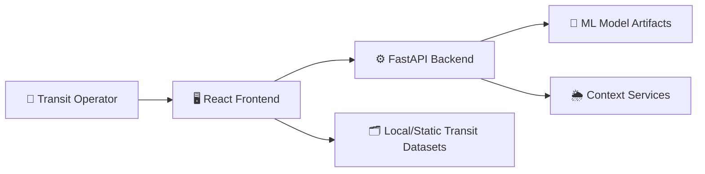
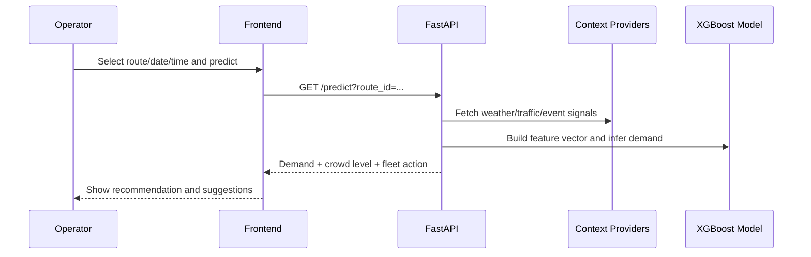
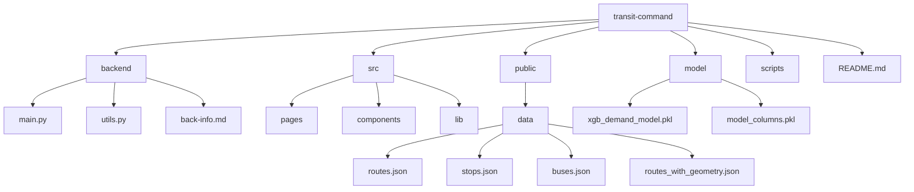

# Coruscant Transit Command 🚍

Coruscant Transit Command is an AI-powered **public transit operations platform**.  
Instead of relying only on static schedules and manual estimation, teams can predict route demand, monitor crowding risk, and take action with data-backed recommendations.

---

## Problem Statement

Transit operators often struggle to manage fleet demand dynamically across routes and time windows.  
Coruscant Transit Command solves this by enabling:

- route-level demand prediction
- context-aware operational decisions (weather, traffic, events)
- transparent admin moderation of field/user suggestions

---

## Solution Overview

Coruscant Transit Command combines:

- a **React frontend** for dashboard, analytics, maps, simulation, and prediction workflows
- a **FastAPI backend** for ML inference and recommendation generation
- a **data-driven operations layer** using route, stop, fleet, and geometry datasets

Operations teams receive prediction insights and fleet recommendations in near real-time.

---

## Architecture (Visual Representation)

---

## Prediction + Action Flow (Visual Representation)

---

## Tech Stack 🧰

| Layer | Technology | Purpose |
|---|---|---|
| Frontend | React 18 + TypeScript + Vite | UI, routing, and operations dashboard |
| Styling | Tailwind CSS + shadcn/ui + Radix UI | Fast, consistent component-driven design |
| Data Visualization | Recharts | Analytics charts and KPI visuals |
| Maps | Leaflet + react-leaflet | Route and stop map rendering |
| State/Data Fetching | TanStack Query | Querying and UI sync for dynamic data |
| Backend | Python + FastAPI + Uvicorn | Prediction API and orchestration |
| ML/Data | pandas + scikit-learn + xgboost | Feature prep and demand inference |
| Context Integration | requests + python-dotenv | Weather/traffic/event data access |
| JavaScript Tooling | npm scripts | Frontend build/dev/test workflows |

---

## Project Structure (Architecture View) 🏗

---

## Environment Configuration

Use local environment setup before running:

- create Python virtual environment in project root: `.venv`
- install backend dependencies from: `backend/requirements.txt`
- optional API override for frontend: `VITE_PREDICTION_API_URL`

> Important: Never commit real API secrets, keys, or production credentials.

---

## Key Features

- Route-wise demand prediction using ML inference
- Crowd level classification (`Low`, `Medium`, `High`)
- Fleet action recommendation (`increase`, `reduce`, `ok`)
- Context-aware suggestions using weather/traffic/event signals
- User suggestion submission with admin approval/rejection flow
- Analytics, simulation, and route/stops map operations views

---

## 👨‍💻 Author

Made with ❤️ by **Shreyash-devs**  
A passionate developer who enjoys turning ideas into reality using tech and a touch of creativity.

- 🔗 [LinkedIn](https://www.linkedin.com/in/shreyashdubewar)  
- 📱 [GitHub](https://github.com/shreyash-devs)  
- ✉️ shreyashdevs.work@gmail.com
